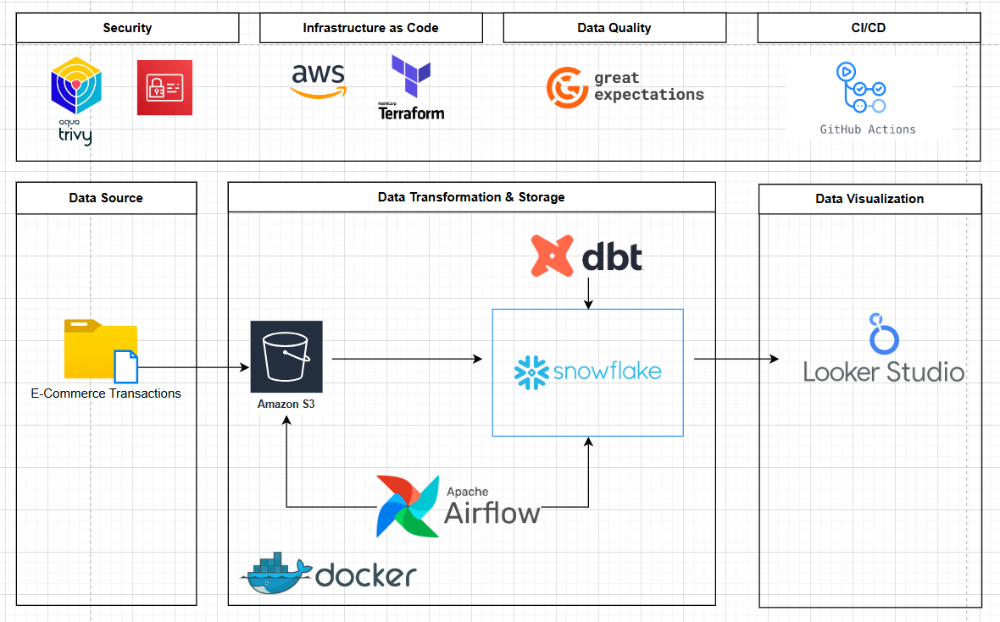

# DataSecOps: Implementing a Secure ELT Pipeline for E-commerce Data Processing.

## Architecture


 

The architecture consists of the following components: 
1. **Data Sources**: A csv file that contains transactions of an ecommerce store.
2. **Data Ingestion**: Python for ingestion.
3. **Data Storage**: Secure data lakes or warehouses (e.g., AWS S3, Snowflake) with encryption at rest.
4. **Data Processing**: ETL tools (dbt) to transform and load data.
5. **Data Security**: Implementation of encryption, access controls, and monitoring.
6. **Data Consumption**: BI tools (e.g., Tableau, Looker) for data analysis and reporting.  
7. **Monitoring & Logging**: Tools like ELK Stack or Prometheus for tracking data pipeline health and security events.


---
## Run the Project
#### Clone the Repository
```bash
git clone https://github.com/Anass-NB/Ecom-DataOps-pipeline.git
cd Ecom-DataOps-pipeline
```
#### Set up a Virtual Environment
```bash
python -m venv venv
source venv/bin/activate  # On Windows use `venv\Scripts\activate`
```
#### Install Dependencies
```bash
pip install -r requirements.txt
```
#### Run Astro
Make sure that Astro is installed on your machine. If not, you can install it by following the instructions [here](https://docs.astronomer.io/astro/cli-installation). and then run the following command in the project root directory:
```bash
astro dev start
```
then you should setup the AWS connection in Airflow UI with your credentials.


### Infrstrcture As a code using Terraform
(Iac)The infrastructure for this project is provisioned using Terraform. The main components include:
- **Storage Module**: This module creates  storage buckets
- **Iam Module**: This module creates the IAM Users needed 

#### Run Terraform
To deploy the infrastructure, navigate to the `include/terraform` directory and run the following commands
```bash
terraform init
terraform plan
terraform apply
```

## Data Quality Expectations (Great Expectations)

This project includes data quality checks using Great Expectations across three layers: **Source**, **Transform**, and **Report**.

### Source Layer

#### `raw_invoices`
| Check | Description |
|-------|-------------|
| Required columns | `InvoiceNo`, `StockCode`, `Quantity`, `InvoiceDate`, `UnitPrice`, `CustomerID`, `Country` must exist |
| Column types | `InvoiceNo` (string), `StockCode` (string), `Quantity` (int), `InvoiceDate` (string), `UnitPrice` (float64), `CustomerID` (float64), `Country` (string) |

---

### Transform Layer

#### `fct_invoices`
| Check | Description |
|-------|-------------|
| Required columns | `invoice_id`, `product_id`, `customer_id`, `datetime_id`, `quantity`, `total` must exist |
| Column types | `invoice_id` (string), `product_id` (string), `customer_id` (string), `datetime_id` (string), `quantity` (int), `total` (float64) |
| No null keys | `invoice_id` cannot be null |
| Positive totals | `total` must be >= 0 |

#### `dim_product`
| Check | Description |
|-------|-------------|
| Required columns | `product_id`, `description`, `price` must exist |
| Column types | `product_id` (string), `description` (string), `price` (float64) |
| Unique products | `product_id` must be unique |
| No null keys | `product_id` cannot be null |
| Non-negative prices | `price` must be >= 0 |

#### `dim_datetime`
| Check | Description |
|-------|-------------|
| Required columns | `datetime_id`, `datetime` must exist |
| Column types | `datetime_id` (string), `datetime` (datetime) |
| Valid weekdays | `weekday` must be between 0-6 |
| Unique datetimes | `datetime_id` must be unique |
| No null keys | `datetime_id` cannot be null |

#### `dim_customer`
| Check | Description |
|-------|-------------|
| Required columns | `customer_id`, `country` must exist |
| Column types | `customer_id` (string), `country` (string) |
| Unique customers | `customer_id` must be unique |
| No null keys | `customer_id` cannot be null |

---

### Report Layer

#### `report_customer_invoices`
| Check | Description |
|-------|-------------|
| No null country | `country` cannot be null |
| Positive invoices | `total_invoices` must be > 0 |

#### `report_product_invoices`
| Check | Description |
|-------|-------------|
| No null stock code | `stock_code` cannot be null |
| Positive quantity | `total_quantity_sold` must be > 0 |

#### `report_year_invoices`
| Check | Description |
|-------|-------------|
| Non-negative invoices | `num_invoices` must be >= 0 |

---

### Running Expectations

Expectation suites are located in `include/gx/expectations/`. To run validations:

```bash
# Initialize GX context
great_expectations init

# Run a checkpoint
great_expectations checkpoint run <checkpoint_name>
```
